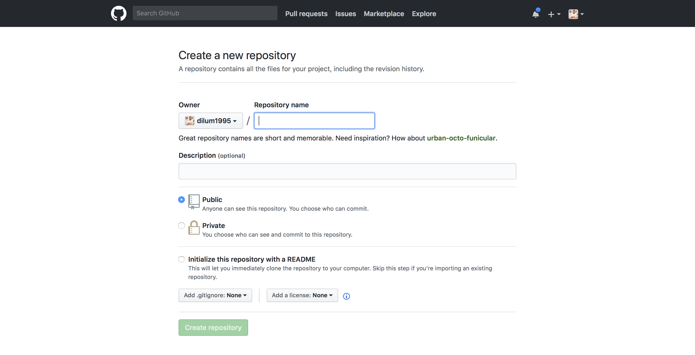
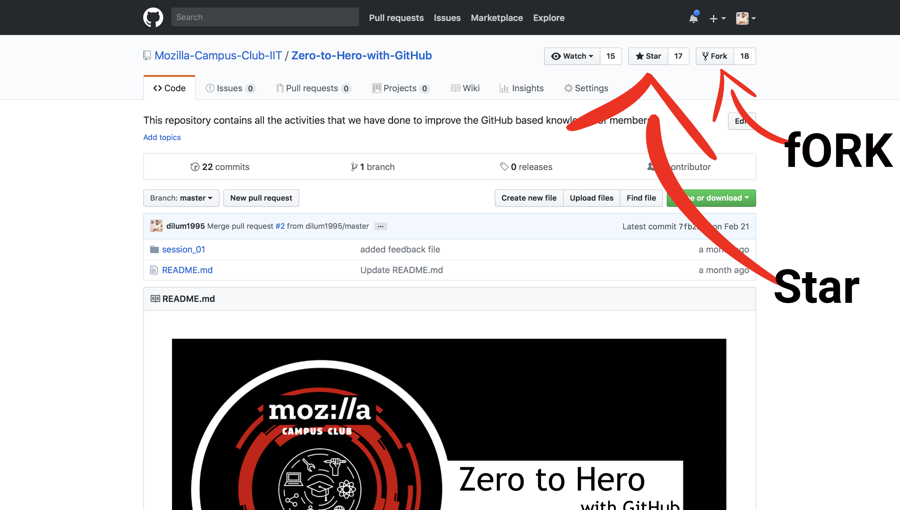
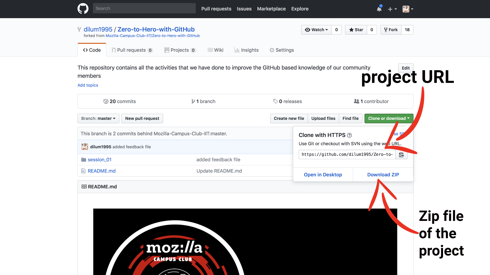

# Zero-to-Hero-with-GitHub (Session 01)

This is a practical session to help the **beginners** to get familiar with GitHub. This session is based on following activities.

1) What is **GitHub**?.
2) My first **GitHub Repository**.
3) My first **Star**.
4) My first **Fork**.
5) My first **Clone/Download**.
6) My first **Commit**.
7) My first **Push**.

<br><br>

### What is **GitHub**?.
GitHub is a web-based hosting service for version control using git. It is mostly used for computer code. It offers all of the distributed version control and source code management functionality of Git as well as adding its own features.

**Founder:** Tom Preston-Werner<br>
**Founded:** 2008<br>
**Headquarters:** San Francisco, California, United States<br>


<br>

## My first **GitHub Repository**.


## My first **GitHub Star and Fork**


## My first **GitHub Clone and Download**


## **To use Git you need to install git in your computer**
Before you start with git commands you have to make sure that you have install git in your computer. You can simply run following command to check whether you have installed git into your computer or not.

```
git --version

```

If you have installed git, once you run this command it will show you your current git version of your computer. If not you can vist following link and install git to your computer.

[Download git,](https://git-scm.com/downloads)

## My first **GitHub Clone through terminal/command prompt**
Once you fork and make an own copy of the project you can clone it. To clone a project you have to copy the project URL as I have shown in the above sample screenshot. Then you have to open a terminal window (for mac users) / command promt(for windows users).

After that as the first step your have to navigate in to the directory where you planing to store your project related stuff. Then the write command **git clone** and paste your project URL.

```
cd project_directory
git clone **project URL which you copied from github project**

```

Once your press enter key this command will download the full project into your navigated directory. So, now you can make changes to the project.


## My first **GitHub Commit**

Once you dowload and make changes or modifications to the project next step is commit changes to your remote git server. To do that you can follow below mentioned steps.
* navigate in to the project directory as the first step.
* write **git status** command to check whether your changes have been captured.
* write **git add .** command to add all the captured changes to your remote git server.

```
cd project_directory
git status 
git add .

```
 
## My first **GitHub Push**
This step will help you to upload all your recently made changes to the online git repository. To do that you have to enter **git push** command.

```
git push

```
